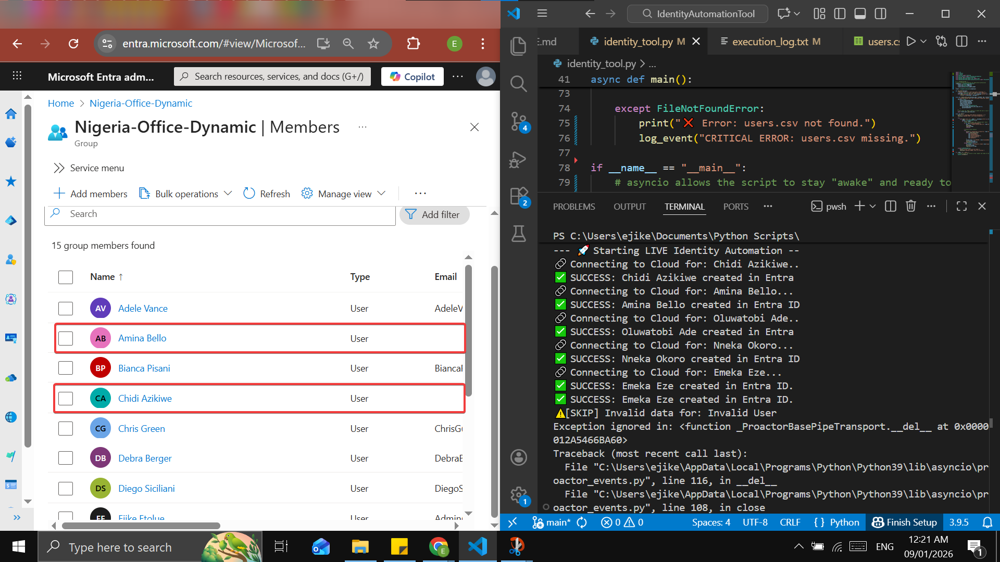
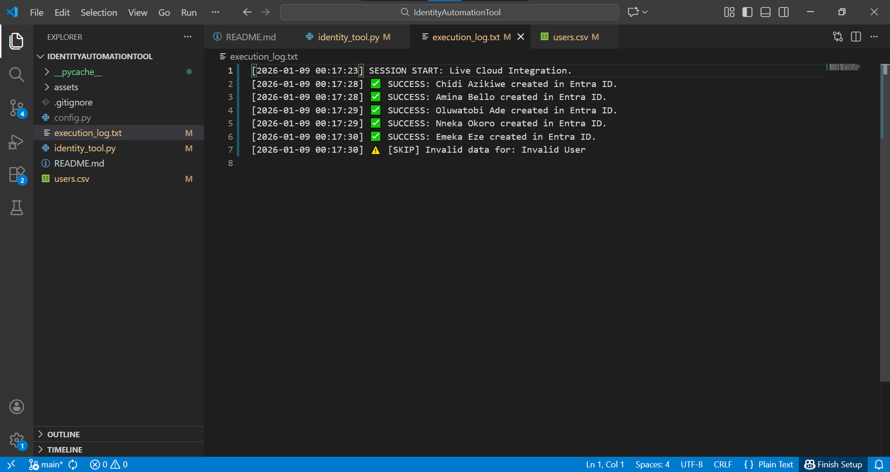

# 🛡️ Entra ID Lifecycle Automation & Zero Trust Enforcement
**An Enterprise-Ready Identity Management Tool built with Python & Microsoft Graph SDK.**

## 📋 Business Problem & Technical Motivation
In enterprise environments, manual identity provisioning is a high-risk activity that leads to **Configuration Drift** and **Over-privileged accounts**. Manual entry is prone to human error, resulting in incorrect user metadata, the very data that modern Zero Trust architectures rely on for automated security decisions.

## 🚀 The Engineered Solution
This tool implements a standardized **Identity Lifecycle Management (ILM)** workflow. By utilizing Python and the Microsoft Graph API, this solution ensures that user identities are provisioned with 100% data integrity, triggering downstream security enforcements automatically.

### Key Engineering Features:
- **Scalable Provisioning:** Bulk-processes user identities via CSV with integrated data validation.
- **Modern Authentication:** Utilizes `ClientSecretCredential` for secure, non-interactive service-to-service communication.
- **Asynchronous Execution:** Built on `asyncio` to handle high-volume API calls with minimal latency.
- **Audit & Compliance:** Generates detailed execution logs for security forensics and compliance tracking.

## ⚙️ Infrastructure & Security Architecture
This project is designed to integrate with a **Zero Trust** framework:
1. **Dynamic Membership (ABAC):** Automated user placement in security groups based on `usageLocation` attributes.
2. **Conditional Access:** Real-time enforcement of Multi-Factor Authentication (MFA) for the provisioned identities.

## 🛠️ Implementation & Usage
1. **Prerequisites:** Python 3.9+, Microsoft Entra ID Tenant.
2. **Configuration:** Define IDs and Secrets in `config.py` (Secured via `.gitignore`).
3. **Execution:**
   ```bash
   python identity_tool.py
   ```

## 📸 Technical Proof of Concept

### 1. Automated Lifecycle Success
Demonstrating successful API integration and the population of the Entra ID tenant with validated identities. The script successfully parsed the CSV, validated data, and created users in the cloud tenant.


### 2. Infrastructure as Code: Dynamic Membership
Proof of Attribute-Based Access Control (ABAC) logic correctly grouping users by location. Users created with a location of 'NG' were automatically added to the Nigeria Security Group.


### 3. Security Enforcement: Zero Trust Gatekeeping
A Conditional Access policy in 'Report-only' mode, targeting the dynamically created group to enforce MFA requirements.


### 4. Operational Logging & Audit Trail
Timestamped logs ensuring every cloud write operation is recorded for compliance and troubleshooting.

