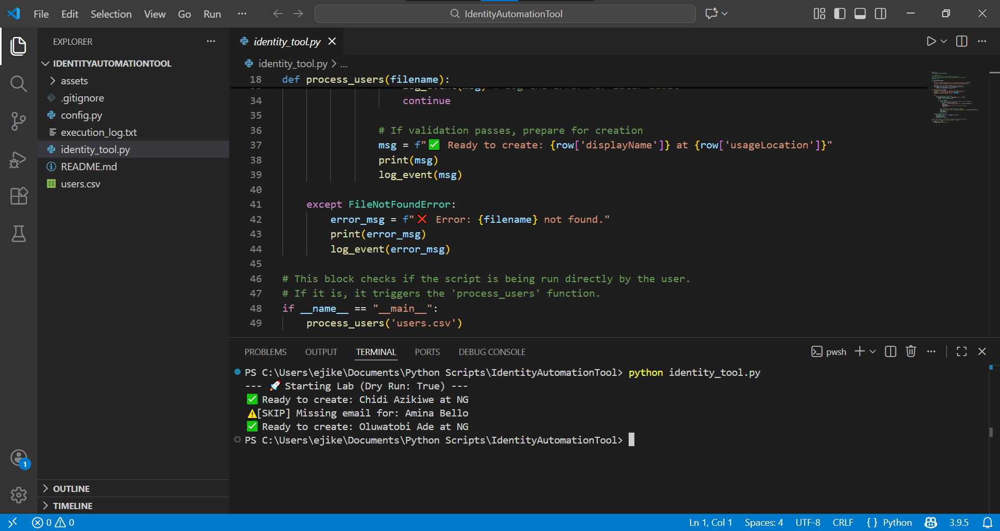

# 🛡️ Entra ID Automation Tool (Python & Microsoft Graph)

## 📋 The Problem
Manually creating users in Microsoft Entra ID (Azure AD) is a slow, repetitive process and highly prone to human error—such as typos in email addresses or missing location data.

## 🚀 The Solution
This tool automates the identity lifecycle management using **Python** and the **Microsoft Graph API**. It allows administrators to:
- Bulk-process users from a `.csv` file.
- Perform "Dry Runs" to verify data before touching the cloud.
- Automatically handle errors (skips rows with missing critical data).
- Generate audit logs for every execution.

## ⚙️ Setup & Requirements
1. **Python 3.x** installed.
2. **Libraries:** `pip install azure-identity msgraph-sdk`
3. **App Registration:**
   - Register an app in Microsoft Entra ID.
   - Grant `User.ReadWrite.All` (Application Permissions).
   - Generate a Client Secret.

## 🛠️ Usage
1. Update `users.csv` with your team's data.
2. Ensure `config.py` contains your Tenant and Client IDs.
3. Run the script:
   ```bash
   python identity_tool.py

   