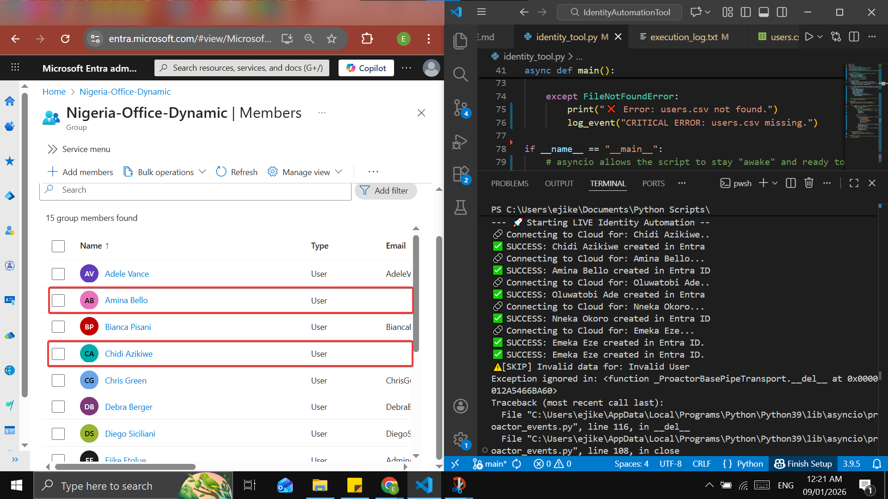
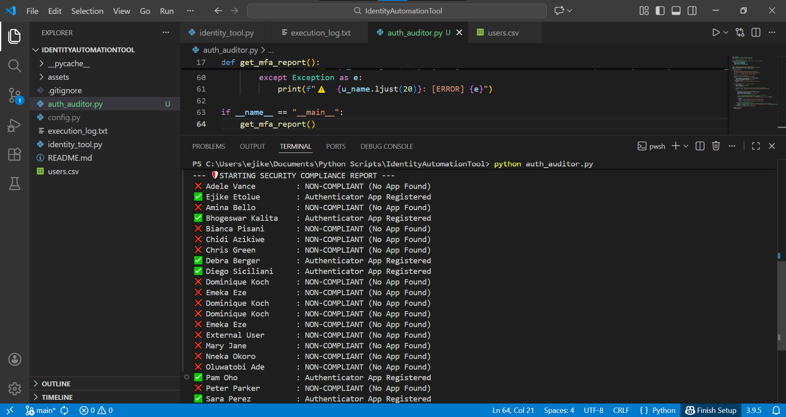
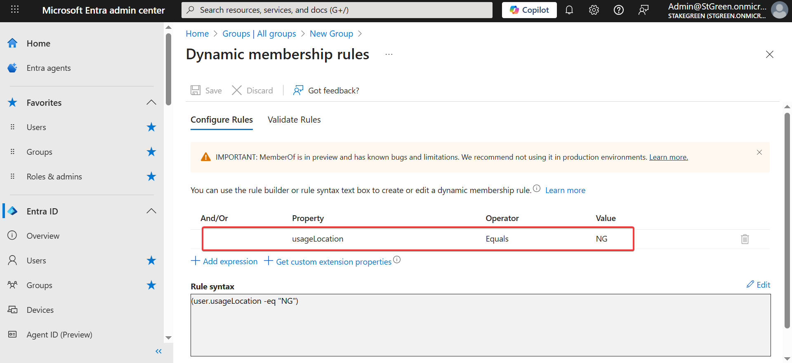
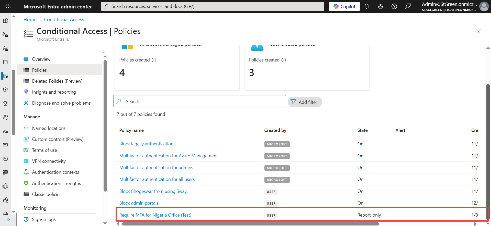
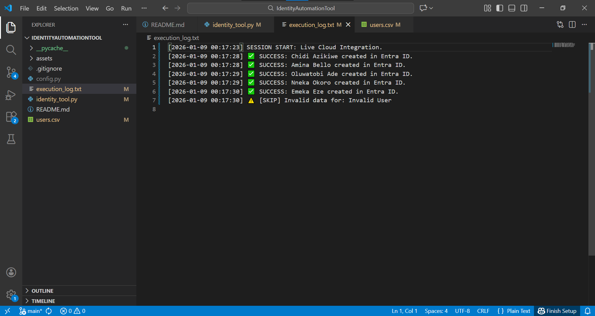
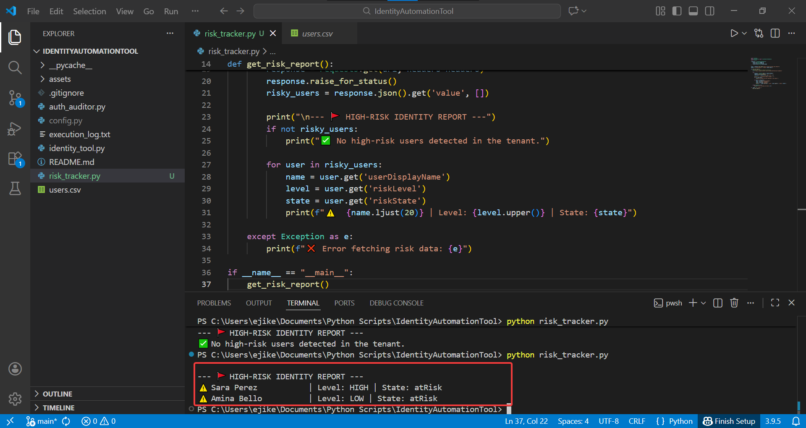
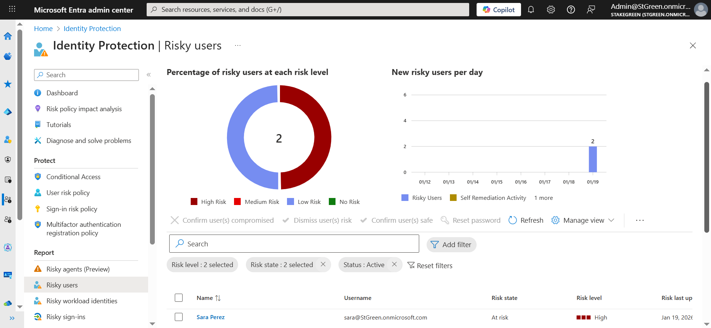

# 🛡️ Entra ID Lifecycle Automation & Zero Trust Enforcement
**An Enterprise-Ready Identity Management & Governance Toolkit built with Python & Microsoft Graph SDK.**

## 📋 Business Problem & Technical Motivation
In enterprise environments, manual identity provisioning is a high-risk activity that leads to **Configuration Drift** and **Over-privileged accounts**. Manual entry is prone to human error, resulting in incorrect user metadata - the very data that modern Zero Trust architectures rely on for automated security decisions.

## 🚀 The Engineered Solution: A Two-Phase Toolkit
This project demonstrates a standardized **Identity Lifecycle Management (ILM)** workflow. By utilizing Python and the Microsoft Graph API, this solution ensures that user identities are not only provisioned with 100% data integrity but are also continuously audited for security compliance.

---

## 🛠️ Core System Features

### 🔹 Feature 1: Automated Lifecycle Provisioning (`identity_tool.py`)
The "Provisioning Engine" focuses on the secure and scalable creation of identities.
* **Scalable Provisioning:** Bulk-processes user identities via CSV with integrated data validation (the "Amina Bello" integrity check).
* **Modern Authentication:** Utilizes `ClientSecretCredential` for secure, non-interactive service-to-service communication.
* **Auditability:** Generates timestamped execution logs (`execution_log.txt`) for security forensics and compliance tracking.

### 🔹 Feature 2: Automated MFA Compliance Auditing (`auth_auditor.py`)
Building on the initial provisioning tool, this module shifts from "Identity Creation" to "Security Governance."
* **Automated Auditing:** Programmatically loops through all tenant identities to verify the registration status of the Microsoft Authenticator app.
* **Compliance Reporting:** Generates a real-time status report in the terminal, identifying non-compliant users who have yet to fulfill MFA requirements.
* **High-Privilege Security:** Leverages the `UserAuthenticationMethod.Read.All` permission scope, secured via a non-interactive Service Principal for background execution.

### 🔹 Feature 3: Adaptive Risk Monitoring (`risk_tracker.py`)
This module shifts the toolkit into "Active Defense," utilizing Entra Identity Protection to detect and report on identity-driven threats.
* **Automated Risk Tracking:** Queries the `identityProtection/riskyUsers` Graph API endpoint to identify accounts with elevated risk levels (Medium/High).
* **Threat Intelligence Integration:** Detects real-time anomalies such as "Anonymous IP Address" (Tor Browser/VPN) and "Unfamiliar Sign-in Properties."
* **Security Forensics:** Provides granular insights into the 'Risk State' and 'Risk Level' of every identity in the tenant for rapid incident response.

---

## 🔐 Identity & Access Logic: Permission Scoping
To maintain the Principle of Least Privilege (PoLP), this toolkit distinguishes between two critical Graph API permission types:
* **Delegated Permissions:** Used for user-centric actions where a user is present. The app acts *on behalf of* the signed-in user (e.g., a user checking their own profile).
* **Application Permissions:** Utilized by this toolkit's "Daemons" (background services). The app acts *without* a signed-in user, accessing data directly via a Service Principal. This is essential for enterprise-wide auditing (e.g., scanning all users for MFA compliance).

---

## ⚙️ Infrastructure & Security Architecture
This toolkit is designed to function within a **Zero Trust** framework:
1. **Dynamic Membership (ABAC):** Automated user placement in security groups based on `usageLocation` attributes.
2. **Conditional Access:** Real-time enforcement of Multi-Factor Authentication (MFA) for the provisioned identities.

---

## 🌐 Future-Proofing with Global Secure Access (GSA)
The infrastructure is designed to integrate with **Microsoft Entra Global Secure Access (SSE)** to provide a unified security fabric:
* **Zero Trust Network Access (ZTNA):** Provisioned identities are compatible with **Private Access** profiles, replacing legacy VPNs with identity-centric perimeters.
* **Unified Security Fabric:** Protects managed identities against malicious web traffic and unauthorized SaaS access at the source.
* **Traffic Visibility:** Automation success is verifiable via **GSA Traffic Logs**, providing an end-to-end audit trail from script execution to network egress.

---

## 🚀 Implementation & Usage
1. **Prerequisites:** Python 3.9+, Microsoft Entra ID Tenant.
2. **Configuration:** Define IDs and Secrets in `config.py` (Secured via `.gitignore`).
3. **Run Provisioning:**
   ```bash
   python identity_tool.py
   ```
4. **Run Security Audit:**
   ```bash
   python auth_auditor.py
   ```

---

## 📸 Technical Proof of Concept

### 1. Automated Lifecycle & Audit Success
The "Identity Jigsaw" in action: The first image demonstrates successful API-driven provisioning, while the second shows the automated MFA compliance report identifying registered vs. non-compliant users.





### 2. Infrastructure as Code: Dynamic Membership
Proof of Attribute-Based Access Control (ABAC) logic correctly grouping users by location. Users created with a location of 'NG' were automatically added to the Nigeria Security Group.



### 3. Security Enforcement: Zero Trust Gatekeeping
A Conditional Access policy in 'Report-only' mode, targeting the dynamically created group to enforce MFA requirements.



### 4. Operational Logging & Audit Trail
Timestamped logs ensuring every cloud operation is recorded for compliance and troubleshooting.



### 5. Adaptive Security: Risk-Based Enforcement
Proof of the toolkit detecting and reacting to a real-world threat. The first image shows the `risk_tracker.py` identifying a user flagged for "Anonymous IP" access via Tor, while the second image displays the corresponding Entra ID Protection dashboard confirming the "High Risk" state.


